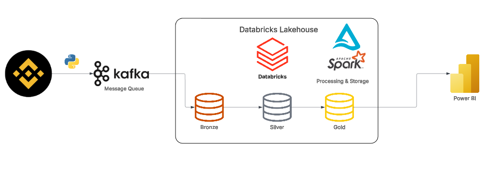

# Real-time Crypto Data Pipeline: Binance to Power BI (Medallion Architecture)

## Project Overview
Dự án này xây dựng một hệ thống **Data Pipeline** nhằm thu thập, xử lý và phân tích dữ liệu thị trường tiền điện tử (Cryptocurrency) theo thời gian thực. 

Thay vì chỉ cào dữ liệu đơn thuần, hệ thống đóng vai trò như một "Bộ não phân tích tự động", biến những luồng giao dịch thô cứng hàng mili-giây thành các **Tín hiệu ra quyết định (Actionable Insights)** có giá trị cao cho Trader, bao gồm: Phát hiện dòng tiền Cá mập (Whale Tracking), phân tích áp lực Mua/Bán (CVD) và tạo tín hiệu giao dịch tự động (Algorithmic Trading Signals).

---

## ⚙️ Kiến trúc Hệ thống (Architecture)
Hệ thống được thiết kế theo chuẩn **Medallion Architecture** (Bronze ➡️ Silver ➡️ Gold) trên nền tảng **Databricks Lakehouse**, đảm bảo khả năng mở rộng, tính toàn vẹn của dữ liệu và tối ưu chi phí (kết hợp giữa Continuous Streaming và Micro-batching).



---
## 🗄️ Cấu trúc Lưu trữ Dữ liệu (Data Catalog Structure)

Toàn bộ dữ liệu của dự án được quản trị tập trung trên **Databricks Unity Catalog**, phân bổ chặt chẽ theo 3 Schema (Database) tương ứng với 3 tầng của kiến trúc Medallion:

```
📂 workspace
 ├── 🥉 bronze (Raw Data Schema)
 │    ├── 🗂️ Tables
 │    │    ├── 📊 kline 
 │    │    └── 📊 trades 
 │    └── 📁 Volumes
 │         └── 📁 binance_raw (Lưu trữ Checkpoint Streaming và Raw data để đảm bảo Fault Tolerance)
 │
 ├── 🥈 silver (Cleaned Data Schema)
 │    ├── 🗂️ Tables
 │    │    ├── 📊 kline  
 │    │    └── 📊 trades 
 │
 └── 🥇 gold (Business-level Schema)
      ├── 🗂️ Tables
      │    ├── 📊 kline_signals    
      │    ├── 📊 minute_order_flow 
      │    └── 📊 whale_alerts   
```
---
## 📥 Nguồn dữ liệu đầu vào (Input)
Dữ liệu được thu thập trực tiếp từ **Binance WebSocket API** (`wss://stream.binance.us:9443`) với tốc độ cao và độ trễ siêu thấp. Hệ thống lắng nghe đồng thời (Multi-plexing) 2 luồng dữ liệu chính của các đồng coin top đầu (BTC, ETH, SOL, BNB, XRP, ADA):
1. **Luồng `aggTrade` (Aggregated Trades):** Từng lệnh khớp trên thị trường (Giá, Khối lượng, Phe chủ động Mua/Bán, Thời gian khớp lệnh chuẩn mili-giây).
2. **Luồng `kline_1m` (Candlestick 1-minute):** Dữ liệu nến 1 phút (Open, High, Low, Close, Volume, Trạng thái đóng nến).

---

## 📤 Dữ liệu đầu ra & Ứng dụng (Output)
Dữ liệu sau khi đi qua luồng xử lý được chuẩn hóa và lưu trữ tại **Tầng Gold (Delta Tables)**, sẵn sàng 100% để trực quan hóa trên **Power BI (DirectQuery)**. Đầu ra bao gồm 3 bảng giá trị lõi:

1. **🚨 Bảng `gold.whale_alerts` (Cảnh báo Cá Mập):**
   * **Output:** Danh sách các lệnh giao dịch khổng lồ theo thời gian thực.
   * **Logic:** Lọc và làm giàu các lệnh có tổng giá trị (`trade_value`) $\ge$ 10,000 USD, gắn nhãn hành động (Chủ động MUA hay BÁN).

2. **📊 Bảng `gold.minute_order_flow` (Áp lực Mua/Bán - CVD):**
   * **Output:** Dòng chảy dòng tiền (Order Flow) được tổng hợp theo từng phút.
   * **Logic:** Áp dụng thuật toán *Tumbling Window* và *Watermarking* của Spark Streaming để tính toán chỉ báo **CVD (Cumulative Volume Delta)** — sự chênh lệch giữa tổng Volume Mua và Volume Bán trong mỗi phút.

3. **📈 Bảng `gold.kline_signals` (Tín hiệu Giao dịch Thuật toán):**
   * **Output:** Bảng dữ liệu nến đã được gắn kèm tín hiệu `BULLISH (BUY)`, `BEARISH (SELL)` hoặc `HOLD`.
   * **Logic:** Áp dụng *Window Functions* để tính độ biến động (Volatility) và Đường trung bình trượt (SMA 15, SMA 50). Xây dựng thuật toán Crossover: Báo lệnh Mua khi SMA 15 cắt lên SMA 50 và ngược lại.

---

## 🛠️ Luồng Xử lý Dữ liệu (Data Flow Pipeline)

* **Ingestion (Python + Kafka):** Script Python đóng vai trò là Producer, thu thập dữ liệu JSON từ WebSocket và đẩy vào Apache Kafka message queue để làm bộ đệm chống sốc dữ liệu.
* **🥉 Tầng Bronze (Raw Data):** Spark Structured Streaming đọc dữ liệu từ Kafka. Giữ nguyên cấu trúc JSON (`raw_payload`) và bổ sung cột `ingested_at` để lưu vết thời gian hệ thống nhận dữ liệu.
* **🥈 Tầng Silver (Cleaned Data):**
  * Ép kiểu (Schema Parsing) JSON thành các cột dữ liệu có cấu trúc.
  * Xử lý lỗi dữ liệu, loại bỏ bản ghi Null (`.dropna()`).
  * Khắc phục độ trễ mạng bằng cách gán chuẩn thời gian giao dịch thực tế (`event_time` thay vì `ingested_at`).
* **🥇 Tầng Gold (Business Logic):** Chạy song song các luồng Streaming và Batch để thực thi các phép tính toán phức tạp (Aggregations) và lưu vào Unity Catalog.

---

## 💻 Công nghệ Sử dụng (Tech Stack)
* **Data Ingestion:** Python, WebSocket, Apache Kafka (Confluent).
* **Data Processing:** Apache Spark (Structured Streaming, PySpark), Databricks Workflows.
* **Storage:** Delta Lake, Databricks Unity Catalog.
* **Visualization:** Power BI (DirectQuery mode).
* **Version Control:** Git, GitHub Integration.
